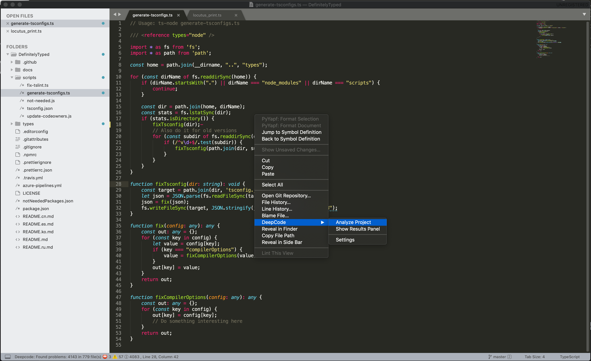
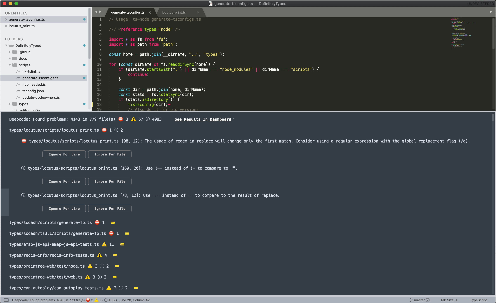

# DeepCodeAI package for Sublime

**The Sublime package provided by <a href="https://www.deepcode.ai/">DeepCode.ai</a> finds bugs and critical vulnerabilities in your code. We support Java, Python, JavaScript, TypeScript and C/C++.**

# Table of Contents

- [DeepCodeAI package for Sublime](#deepcodeai-package-for-sublime)
- [Table of Contents](#table-of-contents)
- [DeepCode package](#deepcode-package)
  - [DeepCode's AI Engine finds bugs](#deepcodes-ai-engine-finds-bugs)
  - [Our AI provides explanation behind found bugs](#our-ai-provides-explanation-behind-found-bugs)
  - [Supported languages](#supported-languages)
- [Installation](#installation)
  - [Prerequisites](#prerequisites)
  - [How to install the package](#how-to-install-the-package)
      - [Command Palette](#command-palette)
  - [Tips on project onboarding](#tips-on-project-onboarding)
- [How to use it?](#how-to-use-it)
  - [Scan or Rescan from context menu](#scan-or-rescan-from-context-menu)
  - [Analysis on Save](#analysis-on-save)
  - [How to ignore suggestions](#how-to-ignore-suggestions)
  - [Opening Results Panel](#opening-results-panel)
  - [Results Panel](#results-panel)
      - [Actions from Results Panel:](#actions-from-results-panel)
  - [Settings](#settings)
- [Feedback and contact](#feedback-and-contact)

# DeepCode package

Through the package you can quickly start using DeepCode's code review and analysis within your development workflow. The package will automatically alert you about critical vulnerabilities you need to solve in your code the moment when you hit _Save_ in your IDE. With DeepCode's superior code review you save time finding and fixing bugs before they go to production.

## DeepCode's AI Engine finds bugs 

DeepCode uses symbolic AI to process hundreds of millions of commits in open sorce software projects and learns how to find serious coding issues. Because the platform determines the intent of the code — and not only the syntax mistakes — DeepCode identifies 10x more critical bugs and security vulnerabilities than other tools.

## Our AI provides explanation behind found bugs

In order to show the detailed explanation of a potential bug, we introduced a new AI technique called _Ontology_. With Ontology, we’ve integrated the capability to present logical argumentation used by the DeepCode engine. 

## Supported languages

Python, JavaScript/TypeScript, Java, C/C++ are currently supported.

# Installation

## Prerequisites
   1. Make sure _Package Control_ is installed (Press ctrl+shift+p, Mac: cmd+shift+p and search for _Package Control_). If you have to install, give it a few seconds until you see the success message
   2. Make sure _Python3_ and _PIP3_ is installed on your machine.

## How to install the package
DeepCode Sublime plugin is available in install package menu.

#### Command Palette
   1. Open the command palette
   2. Win/Linux: ctrl+shift+p, Mac: cmd+shift+p
   3. Type _Install Package_, press enter
   4. Type _DeepCode Sublime Plugin_, press enter
This will download the latest version of DeepCode Sublime Plugin, and it will install package and his dependencies on your machine.

## Tips on project onboarding

- we are serious when it comes to your code. We upload and analyse your code only after you giving us the explicit consent to do so. Your code is protected and used only for the purpose of informing you about issues in code:

   

- once the confirmation is in place we start uploading the files:

   

# How to use it?

## Scan or Rescan from context menu

- Analysis will run on command by selecting `Analyze Project` from `DeepCode` context menu option.
 
 
## Analysis on Save

- Analysis will run on file save event, so you don't have to worry about rescanning project manually.

## How to ignore suggestions

There are two key steps here:

   1. Ignore particular alert directly by using `Ignore for line` or `Ignore for file`:
 
      

   2. DeepCode will create a comment, that will inform our analysis engine to ignore it. Don't forget to specify a description why you think it needs to be ignored. 

## Opening Results Panel  
  
There are two ways to open *Results Panel*

   1. Open Results Panel from context menu. 
   
  
   2. Open Results Panel from panel menu
   
   
## Results Panel 

  Results panel is a place where you can check analysis results grouped by the file.
  
  
 ####  Actions from Results Panel:
   1. See Results In Dashboard (opens the analysis results in the default browser where we also provide example fixes)
   2. _Ignore for Line_ and _Ignore for file_ (adds ignore comment)
   3. Go to File (focuses the line with the issue in the specific file) 

## Settings
   
   You can customize behavior of the package by adding your custom settings in `Settings` section, which you can open either form context menu or from Preferences menu
   
   
  If you need to update the url to the DeepCode server in a self-managed environment or restart the login process, or remove your project form consented list just modify the settings file.
   

# Feedback and contact

- In case you need to contact us or you want to provide feedback, we love to hear from you - [here is how to get in touch with us](https://www.deepcode.ai/feedback).
- If you need to update this file, you can do so by [editing this README.md](https://github.com/DeepCodeAI/sublime-plugin/edit/master/README.md).
